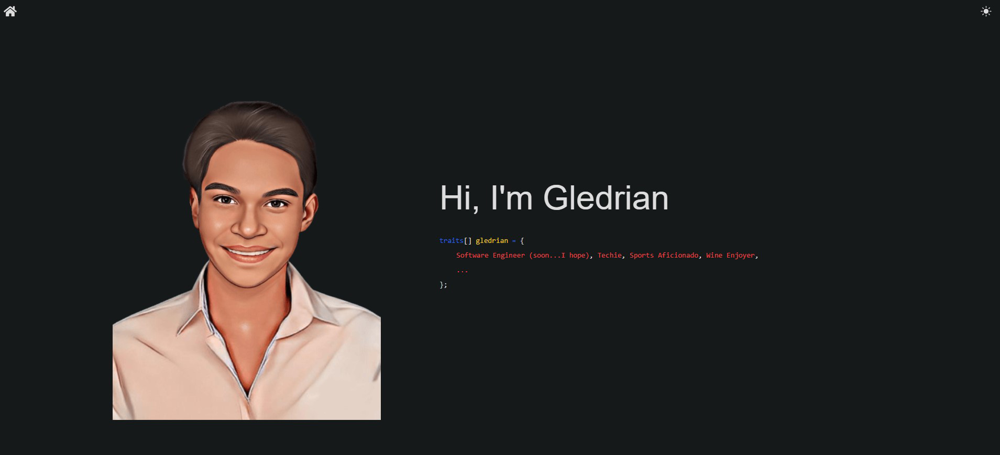

# My Portfolio

Welcome to my personal portfolio website! Built using GatsbyJS, TailwindCSS, and hosted on Netlify, this site is designed to be lightning-fast, SEO-friendly, and accessible across all devices.

Additionally, Google Analytics 4 is integrated to track site performance and user engagement.

This portfolio showcases my skills, projects, and experience as a developer, serving as a central hub for all my professional work, highlighting my journey and passion for web development.

You can view the live version at: [gledrian.dev](https://gledrian.dev)

---

## 🌟 Features

- **Responsive Design**: Optimized for both desktop and mobile devices.
- **Projects Section**: Interactive showcase of my best work with links to live demos and source code.
- **About Me**: Learn about my skills, experience, and background.
- **Contact Form**: Easily get in touch with me directly from the site.

---

## 🔧 Technologies Used

- **Frontend**: GatsbyJS for fast, SEO-friendly performance.
- **Styling**: TailwindCSS for responsive, modern designs.
- **Hosting**: Netlify with global CDN and continuous deployment.
- **Analytics**: Google Analytics 4 for user insights.

---

## 🖼️ Screenshot

Here’s how my portfolio looks:  


---

## 🚀 Getting Started

### Prerequisites

Make sure you have the following installed:

- **Node.js**: [Download Node.js](https://nodejs.org/)
- **npm**: Comes with Node.js installation.

### Steps to Run Locally

1. Clone this repository:

   ```bash
   git clone https://github.com/gutche/portfolio.git
   cd portfolio
   ```

2. Install dependencies:

   ```bash
   npm install
   ```

3. Start the development server:

   ```bash
   npm run dev
   ```

4. Open your browser and navigate to:
   ```
   http://localhost:3000
   ```

---

## 📝 License

This project is licensed under the [MIT License](./LICENSE).
